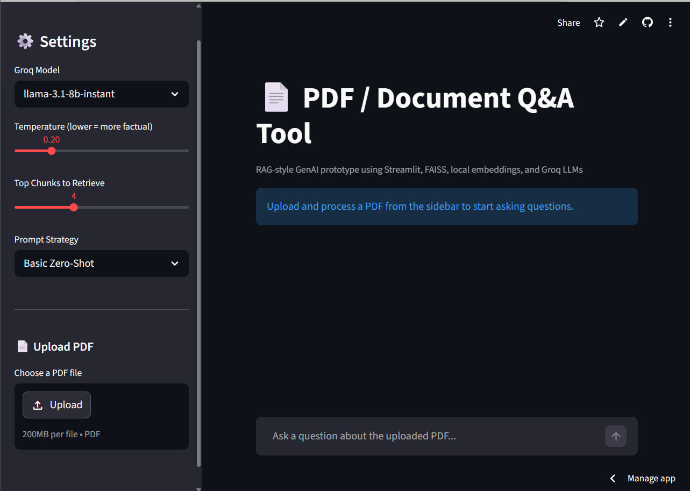

# 📄 PDF / Document Q&A Tool – RAG-style GenAI Prototype

A lightweight **Retrieval-Augmented Generation (RAG)** prototype that allows users to upload a PDF and ask natural-language questions about its contents.

This project was built as a portfolio-ready prototype to demonstrate practical AI engineering skills relevant to **Junior AI Developer** roles, including:

- Prompt engineering
- Gemini API integration
- Data preprocessing
- Semantic retrieval with embeddings
- Retrieval-Augmented Generation (RAG)
- Streamlit prototyping

---

## 🚀 Project Demo

### Core Idea
Upload a PDF → Ask questions → Retrieve relevant chunks → Generate grounded answers with **Google Gemini** → Show source chunks for transparency.

---

## ✨ Features

### 📂 PDF Processing
- Upload any PDF file
- Extract raw text using `PyPDF2`
- Clean and preprocess text
- Split text into **smart overlapping chunks**

### 🧠 Retrieval Pipeline
- Generate local embeddings using:
  - `sentence-transformers`
  - Model: `all-MiniLM-L6-v2`
- Store embeddings in **FAISS**
- Retrieve top relevant chunks using cosine similarity

### 🤖 LLM Answer Generation
- Uses **Google Gemini API (free tier)**:
  - `gemini-1.5-flash`
  - `gemini-2.0-flash`
- Grounded answering based only on retrieved context
- Reduces hallucination by exposing source chunks

### 🧪 Prompt Engineering Showcase
Includes **3 prompt strategies**:

1. **Basic Zero-shot**
2. **Chain-of-Thought**
3. **Grounded + Few-shot**

You can:
- Switch prompt strategy
- Regenerate with stronger prompt
- Compare all prompt versions side-by-side

### 💬 Interactive UI
- Streamlit chat-style interface
- Multi-question conversation in one session
- Retrieved chunk viewer
- Prompt viewer
- Simple answer feedback buttons

---

## 🛠 Tech Stack

- **Python 3.9+**
- **Streamlit**
- **Google Gemini API**
- **PyPDF2**
- **Sentence Transformers**
- **FAISS**
- **python-dotenv**

---

## 📁 Project Structure

```bash
pdf_qa_prototype/
├── app.py
├── utils/
│   ├── pdf_processor.py
│   ├── retriever.py
│   └── prompt_engine.py
├── .env
├── requirements.txt
├── README.md
└── sample_pdfs/
```

---

## ⚙️ Setup Instructions

### 1) Clone the Repository

```bash
git clone https://github.com/yourusername/pdf_qa_prototype.git
cd pdf_qa_prototype
```

### 2) Create Virtual Environment

```bash
python -m venv venv
```

#### Activate on Windows:
```bash
venv\Scripts\activate
```

#### Activate on Mac/Linux:
```bash
source venv/bin/activate
```

### 3) Install Dependencies

```bash
pip install -r requirements.txt
```

### 4) Add Your Gemini API Key

Create a `.env` file in the root folder:

```env
GOOGLE_API_KEY=your_google_gemini_api_key_here
```

You can get your free API key from:
**Google AI Studio** → https://aistudio.google.com/

### 5) Run the App

```bash
streamlit run app.py
```

---

## 🧪 How It Works

### Step 1: PDF Extraction
The uploaded PDF is processed using `PyPDF2`, and text is cleaned.

### Step 2: Chunking
The cleaned text is split into overlapping chunks (default):
- `chunk_size = 600`
- `overlap = 100`

This helps preserve context across chunk boundaries.

### Step 3: Embedding
Each chunk is converted into a vector embedding using:
- `all-MiniLM-L6-v2`

### Step 4: Retrieval
The user’s question is embedded and matched against the chunk vectors using **FAISS**.

### Step 5: Prompt Construction
The retrieved chunks are inserted into a selected prompt template.

### Step 6: Gemini Generation
Gemini generates an answer grounded in the retrieved document context.

---

## 🧠 Prompt Engineering Examples

This project intentionally includes multiple prompt strategies to demonstrate prompt experimentation.

---

### 1) Basic Zero-shot

**Goal:** Simple direct answering from retrieved context.

**Style:** Minimal instruction

**Use case:** Fast baseline prototype

---

### 2) Chain-of-Thought

**Goal:** Encourage structured reasoning before answering

**Style:** Reasoning summary + final answer

**Use case:** Slightly more analytical responses

---

### 3) Grounded + Few-shot (Recommended)

**Goal:** Most reliable document-grounded answers

**Features:**
- Few-shot examples
- Source citation behavior
- Explicit fallback:
  - `"Not enough information in the document."`

**Use case:** Best for factual PDF Q&A

---

## 📸 Screenshot Guide (Add These Before GitHub Upload)

You should add screenshots of:

1. **Main app screen**
   - Sidebar with PDF upload + model settings
   - Chat interface visible

2. **Answer with source chunks**
   - Example question
   - Generated answer
   - Expanded source chunks

3. **Prompt comparison view**
   - Side-by-side outputs for:
     - Basic
     - CoT
     - Grounded + Few-shot

4. **Prompt viewer**
   - Show the actual prompt used for one query

### Suggested Screenshot Filenames
```bash
screenshots/
├── home_ui.png
├── answer_with_sources.png
├── prompt_comparison.png
└── prompt_used.png
```

Then add them in README like:

```markdown
## Screenshots

### Home UI


### Answer + Sources


### Prompt Comparison

```

---

## 🌐 Deployment (Free)

This app is deployable for free on:

### Streamlit Community Cloud
https://share.streamlit.io/

### Deployment Steps
1. Push code to GitHub
2. Open Streamlit Community Cloud
3. Select your repo
4. Set `app.py` as entry point
5. Add your `GOOGLE_API_KEY` in Streamlit Secrets or environment settings
6. Deploy

---

## 🧩 Why This Project Matters

This prototype demonstrates several real-world GenAI engineering skills:

- **RAG pipeline design**
- **Prompt engineering iteration**
- **Document-grounded answering**
- **Local retrieval systems**
- **Practical LLM app building**
- **AI prototyping for business workflows**

This is highly relevant for:
- Junior AI Developer roles
- GenAI prototyping roles
- Applied NLP internships
- AI product engineering portfolios

---

## ⚠️ Current Limitations

- Single-document session (currently one PDF loaded at a time)
- No OCR for scanned PDFs
- No persistent vector database
- No advanced citation parser yet
- No PDF page-level citation mapping yet

---

## 🔮 Future Improvements

Possible next upgrades:

- Multi-PDF support
- OCR support for scanned documents
- Page-number citations
- Export chat as PDF/Markdown
- Better evaluation metrics
- Chunk highlighting in document viewer
- Hybrid retrieval (semantic + keyword)

---

## 👨‍💻 Author

**Your Name**  
AI / ML Portfolio Project

GitHub: [your-github-link]  
LinkedIn: [your-linkedin-link]

---

## 📌 License

This project is open-source and free to use for educational and portfolio purposes.